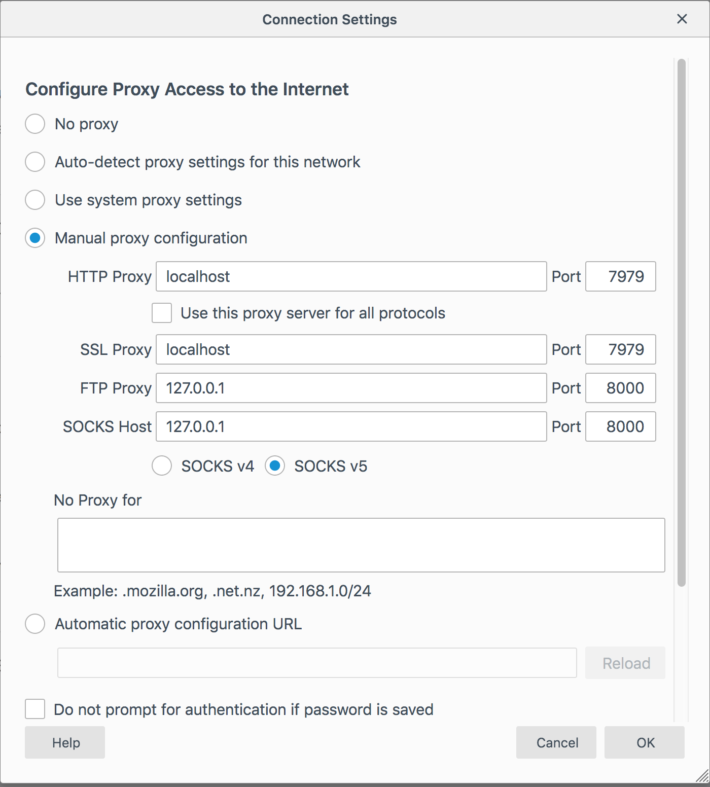

# ProxyPack

ProxyPack is WebPack Plugin that allows you to serve Local Assets to a Production Website.

## Webpack Setup

### Example 1:

In Webpack config add the following:

```
new ProxyPackPlugin({
        browser: 'chrome',
        domain: 'https://secure.helpscout.net',
        mappings: [
            'https://dhmmnd775wlnp.cloudfront.net/*/js/apps/dist/*'
            ]
      })

```

#### Browser

The browser will be the Web Browser you wish to use. Examples inlcude: `chrome, chromium, firefox, ie, opera, safari, phantomjs`

#### Domain

If a domain is included it will also get a warning banner injected.

#### Mappings

`mappings` takes a array of mappings you wish to map to WebPack. In the above example anything sitting on the Cloudfront Server at `'https://dhmmnd775wlnp.cloudfront.net/*/js/apps/dist/*'` will be mapped (via Proxy) to the Webpack build when running ProxyPack.

For example a file sitting at `https://dhmmnd775wlnp.cloudfront.net/777dddkkh/js/apps/dist/dashboard.js`, will resolve to the dist folder of your webpack targeting the file `dashboard.js`.

## External Mappings:

You can also target Non-Webpack files or other Webpack builds with the dictionary `externalMappings`.

```
new ProxyPackPlugin({
        externalMappings: {
            ' https://beacon-v2.helpscout.net/static/js/main.2.1.f3df77f2.js': 'http://localhost:3001/static/js/main.2.1.js'
          }
        ,
      })
```

In this example we are actually running another Webpack server where `http://localhost:3001/static/js/main.2.1.js` is built and we are linking that from our Proxy Server.

### Install SSL Certificate

To view a ProxyPack Build in a Web Browser you must also have a Spoofed SSL certificate installed on your system.

- [MacOS](docs/macos.md)

## To View A Proxy Build

### Launcher Method

You will need to `npm install @helpscout/proxypack -g`.

This will install CLI commands that can launch a Proxied Web Browser that is aware of the ProxyServer running via Webpack.

For example the command `proxypack` will open a Proxied Web Browser in `chrome`.

You can pass the `browser` and / or `domain` flag, to target specific builds and override the values in `ProxyPackPlugin` config.

For example: `proxypack --domain=https://secure.helpscout.net --browser=firefox`. Will open `https://secure.helpscout.net` in `Firefox` and Proxy all the assets you've told Webpack about in `mappings` and `externalMappings`.

### Standalone Method

FireFox has a standalone Proxy that you can find in Preferences. It looks like this:



Just remember, that if you set this up as your proxy, and WebPack isn't connected, you won't be connected to the internet, since FireFox is connecting to the internet through the proxy.

## Thanks

ProxyPack was inspired by [Charles Proxy](https://www.charlesproxy.com/) and [James Proxy](https://github.com/james-proxy/james) and was built with [Hoxy](http://greim.github.io/hoxy/).
